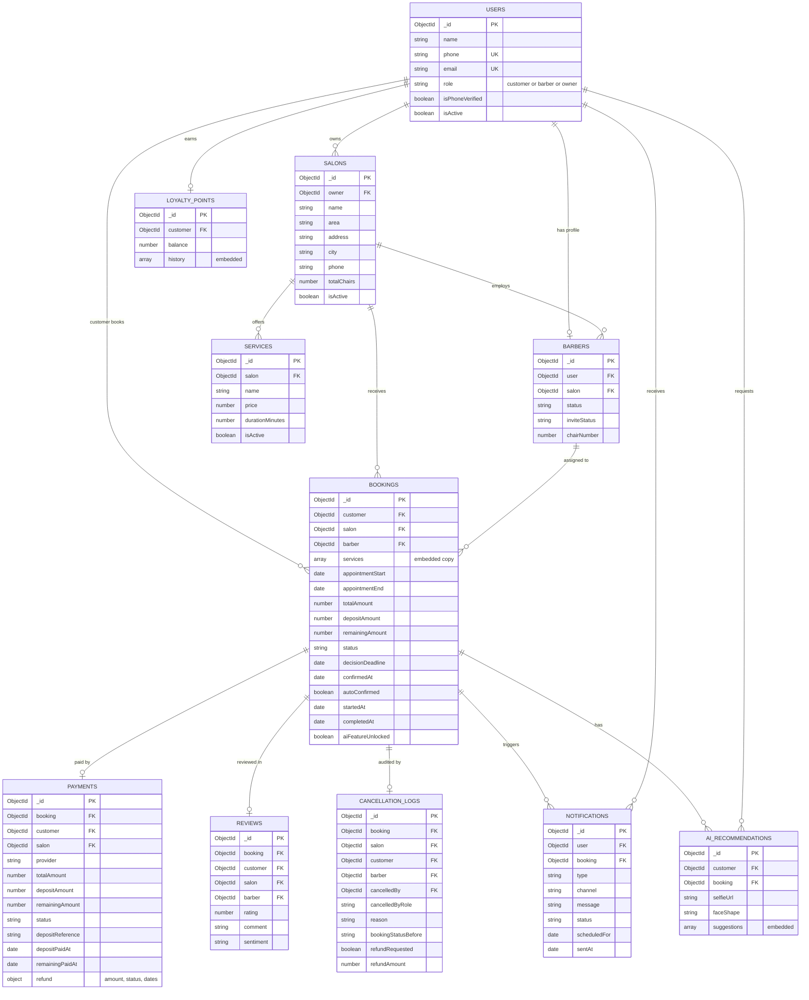
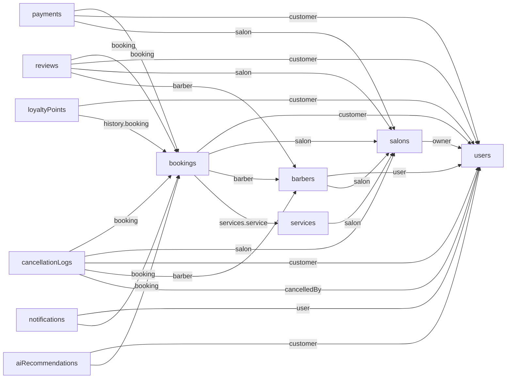
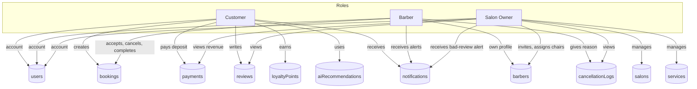
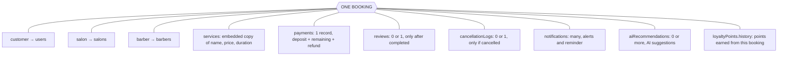
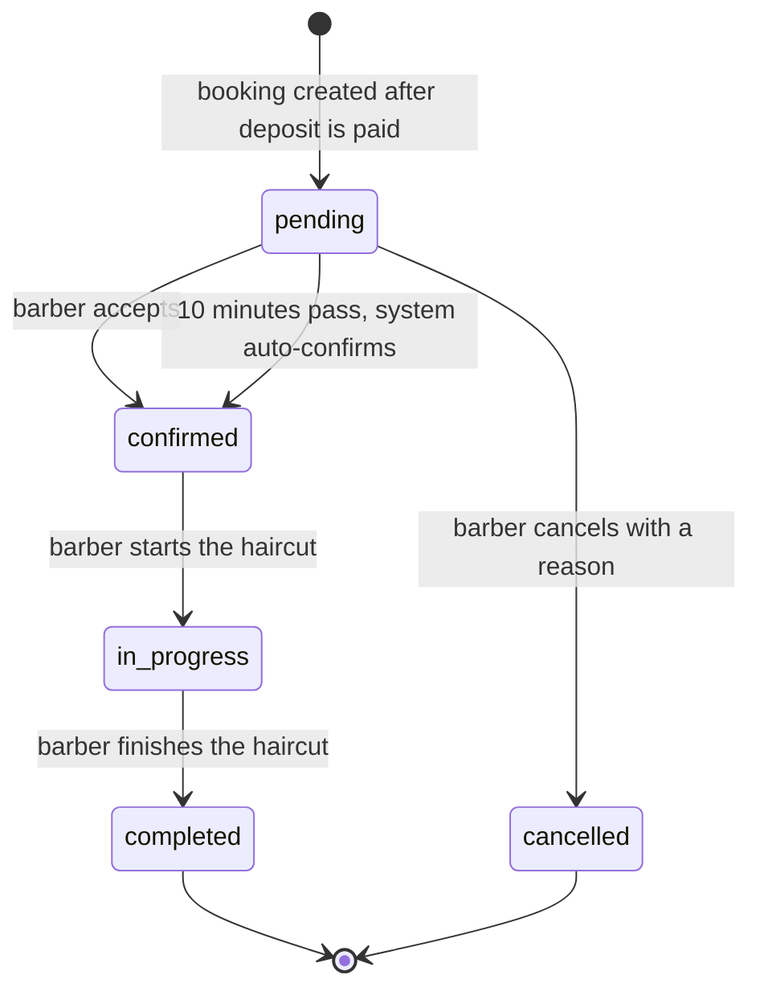
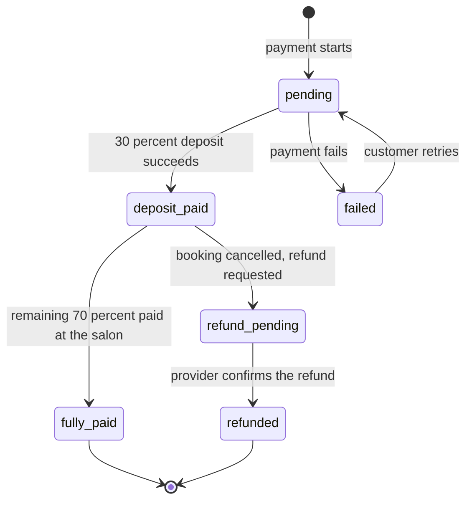
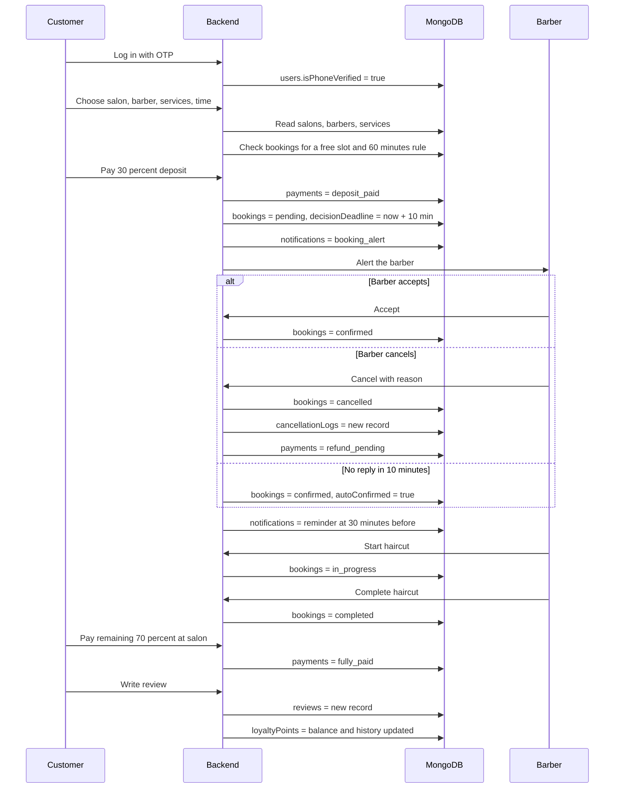
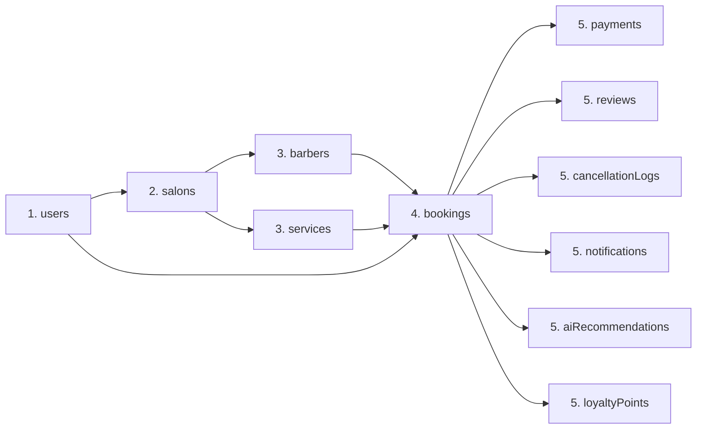

# TRIMLY Database – Data, Roles and Connections

This file contains **only the database**: the 3 roles and their fields, every collection with all its fields, example data, and diagrams that show how everything connects.

- Database name: **`trimly`**
- Collections: **11**
- Example data below is the same fictional data that `npm run setup` inserts. Dates are shown as examples; the real script uses dates relative to the day you run it.

---

## Contents

1. The 11 collections and who uses them
2. The 3 roles and their data (Customer, Barber, Owner)
3. Diagrams (see all connections)
   - 3.1 Full ERD with fields
   - 3.2 Who points to whom (foreign keys)
   - 3.3 Roles and the collections they touch
   - 3.4 Everything attached to one booking
   - 3.5 Booking status flow
   - 3.6 Payment status flow
   - 3.7 One booking, step by step (sequence)
   - 3.8 Order of creating data
4. Every collection: all fields + example data
5. Allowed values
6. Keys and indexes

---

## 1. The 11 collections and who uses them

| # | Collection | Stores | Customer | Barber | Owner |
|---|---|---|:-:|:-:|:-:|
| 1 | `users` | Accounts of all three roles | ✅ | ✅ | ✅ |
| 2 | `salons` | Salon profile, area, chairs | views | works at | **manages** |
| 3 | `barbers` | Barber profile, status, chair | picks one | **own profile** | invites / assigns |
| 4 | `services` | Services, prices, duration | picks | – | **manages** |
| 5 | `bookings` | Every booking | **creates** | **accepts / cancels / completes** | views |
| 6 | `payments` | Deposit, remaining, refund | **pays** | – | views revenue |
| 7 | `reviews` | Rating and comment | **writes** | gets reviewed | views |
| 8 | `loyaltyPoints` | Points and history | **earns** | – | – |
| 9 | `cancellationLogs` | Audit record of cancellations | affected | **creates (reason)** | views |
| 10 | `notifications` | Alerts and reminders | receives | receives | receives |
| 11 | `aiRecommendations` | AI hairstyle results | **uses** | sees result | – |

---

## 2. The 3 roles and their data

All three roles live in the **same `users` collection**. The `role` field decides which one a user is. Each role then has extra data in other collections.

### 2.1 Role: `customer`

**Where a customer appears:** `users` (account) → `bookings.customer` → `payments.customer` → `reviews.customer` → `loyaltyPoints.customer` → `notifications.user` → `aiRecommendations.customer` → `cancellationLogs.customer`

**Their account fields (`users`):**

| Field | Type | Required | Example (Ahmed Raza) |
|---|---|:-:|---|
| `_id` | ID | auto | `c1` |
| `name` | Text | Yes | Ahmed Raza |
| `phone` | Text (unique) | Yes | +923001110004 |
| `email` | Text (unique if given) | No | ahmed.raza@example.com |
| `role` | Text | Yes | customer |
| `isPhoneVerified` | Yes/No | No | true |
| `isActive` | Yes/No | No | true |

**Extra data a customer owns:**

| Collection | Field | Example |
|---|---|---|
| `loyaltyPoints` | `balance` | 20 |
| `loyaltyPoints` | `history[]` | +20 points for booking B1 |
| `bookings` | (his bookings) | B1 completed, B3 confirmed |
| `payments` | (his payments) | P1 fully_paid, P3 deposit_paid |
| `reviews` | (his reviews) | 5 stars for B1 |
| `aiRecommendations` | `faceShape`, `suggestions[]` | Oval; Textured Crop, Classic Side Part |

### 2.2 Role: `barber`

**Where a barber appears:** `users` (account) + `barbers` (profile) → `bookings.barber` → `reviews.barber` → `cancellationLogs.barber`, `cancellationLogs.cancelledBy`

**Account fields (`users`):**

| Field | Type | Required | Example (Usman Ali) |
|---|---|:-:|---|
| `_id` | ID | auto | `u2` |
| `name` | Text | Yes | Usman Ali |
| `phone` | Text (unique) | Yes | +923001110002 |
| `email` | Text | No | – |
| `role` | Text | Yes | barber |
| `isPhoneVerified` | Yes/No | No | true |
| `isActive` | Yes/No | No | true |

**Profile fields (`barbers`):**

| Field | Type | Required | Link | Example |
|---|---|:-:|---|---|
| `_id` | ID | auto | | `b1` (bookings use this ID) |
| `user` | ID (unique) | Yes | → `users` | `u2` (Usman Ali) |
| `salon` | ID | Yes | → `salons` | `s1` (Style Studio) |
| `status` | Text | No | | available |
| `inviteStatus` | Text | No | | active |
| `chairNumber` | Number | No | | 1 |

### 2.3 Role: `owner`

**Where an owner appears:** `users` (account) → `salons.owner`. Through the salon the owner reaches barbers, services, bookings, payments, reviews and cancellation logs.

**Account fields (`users`):**

| Field | Type | Required | Example (Imran Qureshi) |
|---|---|:-:|---|
| `_id` | ID | auto | `o1` |
| `name` | Text | Yes | Imran Qureshi |
| `phone` | Text (unique) | Yes | +923001110001 |
| `email` | Text (unique if given) | No | imran.owner@example.com |
| `role` | Text | Yes | owner |
| `isPhoneVerified` | Yes/No | No | true |
| `isActive` | Yes/No | No | true |

**Salon fields (`salons`) – what the owner manages:**

| Field | Type | Required | Link | Example |
|---|---|:-:|---|---|
| `_id` | ID | auto | | `s1` |
| `owner` | ID | Yes | → `users` | `o1` (Imran Qureshi) |
| `name` | Text | Yes | | Style Studio |
| `description` | Text | No | | Modern men's salon - haircuts, beard styling and grooming. |
| `area` | Text | Yes | | North Nazimabad |
| `address` | Text | No | | Block H, North Nazimabad, Karachi |
| `city` | Text | No | | Karachi |
| `phone` | Text | No | | +922135000001 |
| `totalChairs` | Number | No | | 4 |
| `isActive` | Yes/No | No | | true |

### 2.4 The 5 sample users

| # | `name` | `phone` | `email` | `role` |
|---|---|---|---|---|
| o1 | Imran Qureshi | +923001110001 | imran.owner@example.com | owner |
| u2 | Usman Ali | +923001110002 | – | barber |
| u3 | Danish Sheikh | +923001110003 | – | barber |
| c1 | Ahmed Raza | +923001110004 | ahmed.raza@example.com | customer |
| c2 | Bilal Siddiqui | +923001110005 | – | customer |

---

## 3. Diagrams

*(These are Mermaid diagrams. They show as pictures on GitHub, in VS Code with a Mermaid extension, or if you paste the code into <https://mermaid.live>.)*

### 3.1 Full ERD with fields

Shows all 11 collections, their main fields, primary keys (PK), foreign keys (FK) and unique keys (UK). Lines show how they connect.

How to read the lines: `||--o{` means **one to many** (one salon has many services). `||--o|` means **one to zero-or-one** (a booking has at most one payment).

### 3.2 Who points to whom (foreign keys)

Each arrow is a real field that stores another record's ID. The text on the arrow is the field name.

Read it like this: "`bookings` stores the ID of a `users` record in its `customer` field".

### 3.3 Roles and the collections they touch

### 3.4 Everything attached to one booking

`bookings` is the centre of the database. This shows everything that connects to a single booking.

### 3.5 Booking status flow

`bookings.status` can only move in these directions.

A cancellation after the booking is already `confirmed` is not allowed to override it (a late cancel must not undo a confirmation).

### 3.6 Payment status flow

`payments.status` is kept **separate** from the booking status.

### 3.7 One booking, step by step (sequence)

Shows who does what and which collection is written at each step.

### 3.8 Order of creating data

A child record needs its parent to exist first.

---

## 4. Every collection: all fields + example data

**Column guide:** *Required* = must be filled. *Link* = the collection whose record ID this field holds. *Example* comes from the sample data above.

### 4.1 `users` (see Section 2 for the role-wise view)

| Field | Type | Required | Default | Key | Meaning | Example |
|---|---|:-:|---|---|---|---|
| `_id` | ID | auto | auto | **PK** | Record ID | `c1` |
| `name` | Text | Yes | | | Full name | Ahmed Raza |
| `phone` | Text | Yes | | **Unique** | Login phone number | +923001110004 |
| `email` | Text | No | | **Unique if given** | Optional email | ahmed.raza@example.com |
| `role` | Text | Yes | | index | `customer`, `barber`, `owner` | customer |
| `isPhoneVerified` | Yes/No | No | false | | OTP done | true |
| `isActive` | Yes/No | No | true | | Account in use | true |
| `createdAt`, `updatedAt` | Date | auto | now | | Timestamps | |

### 4.2 `salons`

| Field | Type | Required | Default | Key | Meaning | Example |
|---|---|:-:|---|---|---|---|
| `_id` | ID | auto | auto | **PK** | Record ID | `s1` |
| `owner` | ID | Yes | | **FK** → `users` | Salon owner | `o1` |
| `name` | Text | Yes | | | Salon name | Style Studio |
| `description` | Text | No | | | About the salon | Modern men's salon... |
| `area` | Text | Yes | | index | Search area | North Nazimabad |
| `address` | Text | No | | | Address | Block H, North Nazimabad, Karachi |
| `city` | Text | No | Karachi | | City | Karachi |
| `phone` | Text | No | | | Contact | +922135000001 |
| `totalChairs` | Number | No | 0 | | Number of chairs | 4 |
| `isActive` | Yes/No | No | true | | Visible in search | true |
| `createdAt`, `updatedAt` | Date | auto | now | | Timestamps | |

### 4.3 `barbers`

| Field | Type | Required | Default | Key | Meaning | Example |
|---|---|:-:|---|---|---|---|
| `_id` | ID | auto | auto | **PK** | Record ID | `b1` |
| `user` | ID | Yes | | **FK** → `users`, **Unique** | The barber's account | `u2` |
| `salon` | ID | Yes | | **FK** → `salons` | Where he works | `s1` |
| `status` | Text | No | unavailable | | `available`, `unavailable` | available |
| `inviteStatus` | Text | No | invited | | `invited`, `active` | active |
| `chairNumber` | Number | No | | | Assigned chair | 1 |
| `createdAt`, `updatedAt` | Date | auto | now | | Timestamps | |

Sample rows:

| `_id` | `user` | `salon` | `status` | `inviteStatus` | `chairNumber` |
|---|---|---|---|---|:-:|
| b1 | u2 (Usman Ali) | s1 (Style Studio) | available | active | 1 |
| b2 | u3 (Danish Sheikh) | s1 (Style Studio) | available | active | 2 |

### 4.4 `services`

| Field | Type | Required | Default | Key | Meaning | Example |
|---|---|:-:|---|---|---|---|
| `_id` | ID | auto | auto | **PK** | Record ID | `sv1` |
| `salon` | ID | Yes | | **FK** → `salons` | Which salon | `s1` |
| `name` | Text | Yes | | | Service name | Haircut |
| `price` | Number | Yes | | | Price in Rs. | 1200 |
| `durationMinutes` | Number | Yes | | | Minutes needed | 40 |
| `isActive` | Yes/No | No | true | | Can be booked | true |
| `createdAt`, `updatedAt` | Date | auto | now | | Timestamps | |

Sample rows:

| `_id` | `salon` | `name` | `price` | `durationMinutes` |
|---|---|---|--:|--:|
| sv1 | s1 | Haircut | 1200 | 40 |
| sv2 | s1 | Beard Trim | 800 | 20 |
| sv3 | s1 | Hair Wash & Styling | 500 | 15 |

### 4.5 `bookings`

| Field | Type | Required | Default | Key | Meaning | Example (B1) |
|---|---|:-:|---|---|---|---|
| `_id` | ID | auto | auto | **PK** | Booking ID | `B1` |
| `customer` | ID | Yes | | **FK** → `users` | Who booked | `c1` |
| `salon` | ID | Yes | | **FK** → `salons` | Which salon | `s1` |
| `barber` | ID | Yes | | **FK** → `barbers` | Which barber | `b1` |
| `services` | List (1 or more) | Yes | | | Embedded copy of services | see below |
| `services[].service` | ID | Yes | | **FK** → `services` | Original service | `sv1` |
| `services[].name` | Text | Yes | | | Name when booked | Haircut |
| `services[].price` | Number | Yes | | | Price when booked | 1200 |
| `services[].durationMinutes` | Number | Yes | | | Duration when booked | 40 |
| `appointmentStart` | Date | Yes | | index | Start time | 3 Oct 2026, 4:00 PM |
| `appointmentEnd` | Date | Yes | | | End time | 3 Oct 2026, 5:00 PM |
| `totalAmount` | Number | Yes | | | Full price | 2000 |
| `depositAmount` | Number | Yes | | | 30% | 600 |
| `remainingAmount` | Number | Yes | | | 70% | 1400 |
| `status` | Text | Yes | pending | index | Booking state | completed |
| `decisionDeadline` | Date | Yes | | index | Created time + 10 min | 2 Oct 2026, 4:10 PM |
| `confirmedAt` | Date | No | | | When confirmed | 2 Oct 2026, 4:04 PM |
| `autoConfirmed` | Yes/No | No | false | | System confirmed it | false |
| `startedAt` | Date | No | | | Haircut started | 3 Oct 2026, 4:02 PM |
| `completedAt` | Date | No | | | Haircut finished | 3 Oct 2026, 4:58 PM |
| `aiFeatureUnlocked` | Yes/No | No | false | | AI feature unlocked | true |
| `createdAt`, `updatedAt` | Date | auto | now | | Timestamps | |

Sample rows:

| ID | Customer | Barber | Services | Total | Deposit | Remaining | Status | Notes |
|---|---|---|---|--:|--:|--:|---|---|
| B1 | Ahmed Raza | Usman Ali | Haircut + Beard Trim | 2000 | 600 | 1400 | completed | 2 days ago, AI feature unlocked |
| B2 | Bilal Siddiqui | Danish Sheikh | Haircut | 1200 | 360 | 840 | cancelled | Cancelled by the barber |
| B3 | Ahmed Raza | Usman Ali | Beard Trim | 800 | 240 | 560 | confirmed | Tomorrow, auto-confirmed |

What is inside `services` for B1:

| `service` | `name` | `price` | `durationMinutes` |
|---|---|--:|--:|
| sv1 | Haircut | 1200 | 40 |
| sv2 | Beard Trim | 800 | 20 |

### 4.6 `payments`

| Field | Type | Required | Default | Key | Meaning | Example (P1) |
|---|---|:-:|---|---|---|---|
| `_id` | ID | auto | auto | **PK** | Payment ID | `P1` |
| `booking` | ID | No | | **FK** → `bookings`, **Unique if given** | The booking | `B1` |
| `customer` | ID | Yes | | **FK** → `users` | Who paid | `c1` |
| `salon` | ID | Yes | | **FK** → `salons` | Who received | `s1` |
| `provider` | Text | Yes | | | `jazzcash`, `easypaisa` | jazzcash |
| `totalAmount` | Number | Yes | | | Full amount | 2000 |
| `depositAmount` | Number | Yes | | | 30% | 600 |
| `remainingAmount` | Number | Yes | | | 70% | 1400 |
| `status` | Text | Yes | pending | index | Payment state | fully_paid |
| `depositReference` | Text | No | | | Provider reference | JC-SANDBOX-0001 |
| `depositPaidAt` | Date | No | | | Deposit time | 2 Oct 2026, 4:00 PM |
| `remainingPaidAt` | Date | No | | | Remaining paid time | 3 Oct 2026, 5:00 PM |
| `refund` | Object | No | | | Refund details (only if refunded) | – |
| `refund.amount` | Number | If refund | | | Amount to return | – |
| `refund.status` | Text | If refund | pending | | `pending`, `completed`, `failed` | – |
| `refund.requestedAt` | Date | No | now | | Request time | – |
| `refund.completedAt` | Date | No | | | Confirmed time | – |
| `refund.providerReference` | Text | No | | | Refund reference | – |
| `createdAt`, `updatedAt` | Date | auto | now | | Timestamps | |

Sample rows:

| ID | Booking | Provider | Total | Deposit | Remaining | `status` | Reference | Refund |
|---|---|---|--:|--:|--:|---|---|---|
| P1 | B1 | jazzcash | 2000 | 600 | 1400 | fully_paid | JC-SANDBOX-0001 | – |
| P2 | B2 | easypaisa | 1200 | 360 | 840 | refund_pending | EP-SANDBOX-0002 | Rs. 360, `pending` |
| P3 | B3 | jazzcash | 800 | 240 | 560 | deposit_paid | JC-SANDBOX-0003 | – |

### 4.7 `reviews`

| Field | Type | Required | Default | Key | Meaning | Example |
|---|---|:-:|---|---|---|---|
| `_id` | ID | auto | auto | **PK** | Review ID | `R1` |
| `booking` | ID | Yes | | **FK** → `bookings`, **Unique** | Reviewed booking | `B1` |
| `customer` | ID | Yes | | **FK** → `users` | Reviewer | `c1` |
| `salon` | ID | Yes | | **FK** → `salons` | Salon reviewed | `s1` |
| `barber` | ID | Yes | | **FK** → `barbers` | Barber reviewed | `b1` |
| `rating` | Number | Yes | | 1 to 5 | Stars | 5 |
| `comment` | Text | No | | | Review text | Great haircut and very professional service. |
| `sentiment` | Text | No | | | `positive`, `neutral`, `negative` | positive |
| `createdAt`, `updatedAt` | Date | auto | now | | Timestamps | |

### 4.8 `loyaltyPoints`

| Field | Type | Required | Default | Key | Meaning | Example |
|---|---|:-:|---|---|---|---|
| `_id` | ID | auto | auto | **PK** | Record ID | `L1` |
| `customer` | ID | Yes | | **FK** → `users`, **Unique** | Point owner | `c1` |
| `balance` | Number | Yes | 0 | | Current points | 20 |
| `history` | List | No | empty | | Embedded history | 1 entry |
| `history[].booking` | ID | Yes | | **FK** → `bookings` | Booking that earned points | `B1` |
| `history[].points` | Number | Yes | | | Points added | 20 |
| `history[].reason` | Text | No | Completed appointment | | Why | Completed appointment |
| `history[].createdAt` | Date | No | now | | When | 3 Oct 2026, 5:00 PM |
| `createdAt`, `updatedAt` | Date | auto | now | | Timestamps | |

### 4.9 `cancellationLogs`

| Field | Type | Required | Default | Key | Meaning | Example |
|---|---|:-:|---|---|---|---|
| `_id` | ID | auto | auto | **PK** | Log ID | `CL1` |
| `booking` | ID | Yes | | **FK** → `bookings`, **Unique** | Cancelled booking | `B2` |
| `salon` | ID | Yes | | **FK** → `salons` | Salon | `s1` |
| `customer` | ID | Yes | | **FK** → `users` | Customer | `c2` |
| `barber` | ID | Yes | | **FK** → `barbers` | Barber | `b2` |
| `cancelledBy` | ID | Yes | | **FK** → `users` | Who cancelled | `u3` |
| `cancelledByRole` | Text | Yes | | | `customer`, `barber`, `owner` | barber |
| `reason` | Text | Yes (not empty) | | | Compulsory reason | Barber has an emergency and is not available at that time. |
| `bookingStatusBefore` | Text | Yes | | | Status before cancel | pending |
| `refundRequested` | Yes/No | No | false | | Refund asked? | true |
| `refundAmount` | Number | No | | | Refund amount | 360 |
| `createdAt` | Date | auto | now | | When logged (no `updatedAt`) | |

### 4.10 `notifications`

| Field | Type | Required | Default | Key | Meaning | Example (N3) |
|---|---|:-:|---|---|---|---|
| `_id` | ID | auto | auto | **PK** | Notification ID | `N3` |
| `user` | ID | Yes | | **FK** → `users` | Receiver | `c1` |
| `booking` | ID | No | | **FK** → `bookings` | Related booking | `B3` |
| `type` | Text | Yes | | | Kind of message | reminder |
| `channel` | Text | No | whatsapp | | `whatsapp`, `sms`, `in_app` | whatsapp |
| `message` | Text | Yes | | | Message text | Reminder: your Beard Trim at Style Studio starts in 30 minutes. |
| `status` | Text | Yes | pending | index | `pending`, `sent`, `failed`, `skipped` | pending |
| `scheduledFor` | Date | No | | index | When to send | 4 Oct 2026, 5:30 PM |
| `sentAt` | Date | No | | | When sent | – |
| `createdAt`, `updatedAt` | Date | auto | now | | Timestamps | |

Sample rows:

| ID | To | Booking | `type` | `status` | Message (short) |
|---|---|---|---|---|---|
| N1 | Usman Ali (barber) | B1 | booking_alert | sent | New booking from Ahmed Raza. Please accept or cancel within 10 minutes. |
| N2 | Bilal Siddiqui (customer) | B2 | booking_cancelled | sent | Your booking was cancelled by the barber. Your Rs. 360 deposit refund is pending. |
| N3 | Ahmed Raza (customer) | B3 | reminder | pending | Reminder: your Beard Trim at Style Studio starts in 30 minutes. |

### 4.11 `aiRecommendations`

| Field | Type | Required | Default | Key | Meaning | Example |
|---|---|:-:|---|---|---|---|
| `_id` | ID | auto | auto | **PK** | Record ID | `A1` |
| `customer` | ID | Yes | | **FK** → `users` | Who used it | `c1` |
| `booking` | ID | No | | **FK** → `bookings` | Attached appointment | `B1` |
| `selfieUrl` | Text | No | | | Link to the selfie (image not stored in DB) | https://example.com/demo/selfie-ahmed.jpg |
| `faceShape` | Text | No | | | Face-shape result | Oval |
| `suggestions` | List | No | empty | | Embedded suggestions | 2 entries |
| `suggestions[].name` | Text | Yes | | | Hairstyle | Textured Crop |
| `suggestions[].description` | Text | No | | | Description | Short sides with a textured top. |
| `createdAt` | Date | auto | now | | Created (no `updatedAt`) | |

---

## 5. Allowed values

| Field | Allowed values |
|---|---|
| `users.role`, `cancellationLogs.cancelledByRole` | `customer`, `barber`, `owner` |
| `barbers.status` | `available`, `unavailable` |
| `barbers.inviteStatus` | `invited`, `active` |
| `bookings.status`, `cancellationLogs.bookingStatusBefore` | `pending`, `confirmed`, `cancelled`, `in_progress`, `completed` |
| `payments.status` | `pending`, `deposit_paid`, `fully_paid`, `refund_pending`, `refunded`, `failed` |
| `payments.provider` | `jazzcash`, `easypaisa` |
| `payments.refund.status` | `pending`, `completed`, `failed` |
| `reviews.sentiment` | `positive`, `neutral`, `negative` |
| `notifications.type` | `booking_alert`, `booking_confirmed`, `booking_cancelled`, `reminder`, `negative_review_alert`, `refund_update` |
| `notifications.channel` | `whatsapp`, `sms`, `in_app` |
| `notifications.status` | `pending`, `sent`, `failed`, `skipped` |

---

## 6. Keys and indexes

### 6.1 Key types

| Key | Meaning | Where used |
|---|---|---|
| **PK** (primary key) | `_id`, the record's own unique ID | Every collection |
| **FK** (foreign key) | A field holding another record's ID | See diagram 3.2 |
| **Unique** | Value may appear only once | `users.phone`, `barbers.user`, `reviews.booking`, `loyaltyPoints.customer`, `cancellationLogs.booking` |
| **Unique if given** | Can be empty; if filled, must be unique | `users.email`, `payments.booking` |

MongoDB does **not** check that an FK points to a real record and does **not** delete child records automatically. The backend must handle that, so records are switched off with `isActive: false` instead of being deleted.

### 6.2 One-to-one links (enforced by a unique key)

| Link | Meaning |
|---|---|
| `barbers.user` | One user has at most one barber profile |
| `payments.booking` | One booking has one payment record |
| `reviews.booking` | One booking has one review |
| `cancellationLogs.booking` | One booking has one cancellation record |
| `loyaltyPoints.customer` | One customer has one points record |

### 6.3 Indexes (speed up searching)

| Collection | Index | Unique | Why |
|---|---|:-:|---|
| users | `phone` | Yes | Login lookup |
| users | `email` | Yes (if given) | No duplicate emails |
| users | `role` | No | Filter by role |
| salons | `owner` | No | Owner's salons |
| salons | `area`, `isActive` | No | Search salons by area |
| barbers | `user` | Yes | One profile per user |
| barbers | `salon`, `status` | No | Staff and online staff |
| services | `salon`, `isActive` | No | A salon's services |
| bookings | `customer`, `appointmentStart` | No | Customer history |
| bookings | `barber`, `appointmentStart`, `status` | No | Barber schedule, slot check |
| bookings | `salon`, `appointmentStart`, `status` | No | Owner reports |
| bookings | `status`, `decisionDeadline` | No | Pending bookings past 10 minutes |
| payments | `booking` | Yes (if given) | One payment per booking |
| payments | `customer` | No | Customer's payments |
| payments | `salon`, `status`, `createdAt` | No | Revenue reports |
| reviews | `booking` | Yes | One review per booking |
| reviews | `salon`, `createdAt` | No | Salon reviews |
| reviews | `barber`; `customer` | No | Reviews by barber / customer |
| loyaltyPoints | `customer` | Yes | One record per customer |
| cancellationLogs | `booking` | Yes | One log per booking |
| cancellationLogs | `salon`, `createdAt`; `cancelledBy` | No | Owner's list; who cancelled |
| notifications | `user`, `createdAt` | No | User's notifications |
| notifications | `status`, `scheduledFor` | No | Reminder job |
| aiRecommendations | `customer`, `createdAt`; `booking` | No | Customer history; appointment suggestions |
